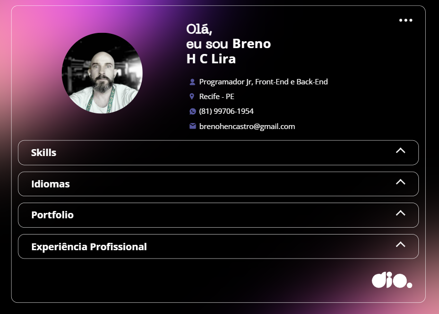

# Projeto FrontEnd de criação do meu Portfolio Pessoal

Tela de preview do App

## Descrição: 
Este projeto é um Front-End que consome API de um arquivo json hospedado num sevidor web. Ele implementa um deploy dos dados de maneira que você precisa apenas atualizar o json e commitar as alterações desejadas, utilizando-se do GitHub Pages para sua hospedagem.  

## Objetivos 
- Criar um Portfolio com Javascript, CSS e HTML5. 
- Implementar funções assíncronas para consumir a API FETCH. 
- Tratar o resultado JSON e interpolar de volta no HTML através de Manipulação do DOM. 
- Popular o HTML automaticamente com meus dados do JSON.
 
## Tecnologias Utilizadas
- HTML5 
- CSS 
- Javascript 
- NODEjs 
- GitHub
